# 🍿 usePopcorn

<div align="center">


**A Modern Movie Discovery & Rating Platform**

[](https://reactjs.org/)
[](https://vitejs.dev/)
[](https://developer.mozilla.org/en-US/docs/Web/JavaScript)
[](https://developer.mozilla.org/en-US/docs/Web/CSS)
[](http://www.omdbapi.com/)

---

*Discover, rate, and manage your favorite movies with a stunning cyberpunk interface*

</div>

## 📋 Table of Contents

- [🌟 Features](#-features)
- [🔧 Technology Stack](#-technology-stack)
- [⚙️ How It Works](#️-how-it-works)
- [🚀 Quick Start](#-quick-start)
- [📁 Project Structure](#-project-structure)
- [🎨 Design System](#-design-system)
- [📊 Component Architecture](#-component-architecture)
- [🎯 API Integration](#-api-integration)
- [🔒 Local Storage Implementation](#-local-storage-implementation)
- [🪝 Custom Hooks](#-custom-hooks)
- [📱 Responsive Design](#-responsive-design)
- [🛠️ Development](#-development)
- [🤝 Contributing](#-contributing)

## 🌟 Features

### ✨ Core Functionality

| Feature | Status | Description |
|---------|--------|-------------|
| 🔍 **Movie Search** | ✅ | Real-time movie search using OMDB API |
| ⭐ **Rating System** | ✅ | Interactive star rating (1-10 scale) |
| 📚 **Watchlist Management** | ✅ | Add/remove movies from personal watchlist |
| 💾 **Persistent Storage** | ✅ | Local storage for watched movies |
| 📱 **Responsive Design** | ✅ | Mobile-first responsive layout |
| 🎨 **Cyberpunk Theme** | ✅ | Stunning neon-themed UI |
| ⚡ **Real-time Updates** | ✅ | Instant search results |
| 🔄 **State Management** | ✅ | Custom React hooks |

### 🎯 User Experience

- **Instant Search**: Type and get results in real-time
- **Smart Keyboard Navigation**: Press `Enter` to focus search, `Escape` to close details
- **Visual Feedback**: Hover effects, transitions, and animations
- **Error Handling**: Graceful error messages and loading states
- **Accessibility**: Full keyboard navigation and screen reader support

## 🔧 Technology Stack

<div align="center">

### Frontend Technologies

| Technology | Version | Purpose | Why Chosen |
|------------|---------|---------|------------|
|  | 19.1.1 | UI Library | Component-based architecture, excellent ecosystem |
|  | 7.1.7 | Build Tool | Lightning-fast HMR, modern build optimizations |
|  | ES6+ | Programming Language | Modern syntax, async/await, destructuring |
|  | Custom | Styling & Animations | CSS Grid, Flexbox, custom properties, animations |
|  | 9.36.0 | Code Linting | Code quality, consistency, error prevention |

### External Services & APIs

| Service | Purpose | Implementation |
|---------|---------|----------------|
|  | Movie Data | RESTful API calls with fetch() |
|  | Data Persistence | Browser storage for watchlist |

</div>

## ⚙️ How It Works

### 🔄 Application Flow


### 🔍 Search Process

1. **User Input**: User types in search box
2. **Debounced API Call**: `useMovies` hook triggers after 3+ characters
3. **API Request**: Fetch request to OMDB with search query
4. **Error Handling**: Network/API errors are caught and displayed
5. **Results Display**: Movies rendered in list format
6. **Loading States**: Loading spinner shown during requests

### ⭐ Rating & Watchlist Process

1. **Movie Selection**: User clicks on movie from search results
2. **Detail Fetch**: `useMovie` hook fetches detailed movie info
3. **Rating Interface**: StarRating component allows 1-10 rating
4. **Add to Watchlist**: Movie object created with user rating
5. **Local Storage**: Watched movies array updated and persisted
6. **Statistics Update**: Summary component recalculates averages

## 🚀 Quick Start

### Prerequisites

-  **Node.js** (v16.0.0 or higher)
-  **npm** or  **yarn**

### Installation

```bash
# 1. Clone the repository
git clone https://github.com/eslamomar/usepopcorn.git

# 2. Navigate to project directory
cd usepopcorn

# 3. Install dependencies
npm install

# 4. Start development server
npm run dev

# 5. Open your browser
# Visit: http://localhost:5173
```

### Build for Production

```bash
# Build optimized production version
npm run build

# Preview production build
npm run preview
```

## 📁 Project Structure

```
usePopcorn/
├── 📁 public/
│   └── 🖼️ favicon and assets
├── 📁 src/
│   ├── 📁 Components/
│   │   ├── 📁 Main/
│   │   │   ├── 🧩 Box.jsx              # Collapsible container component
│   │   │   ├── 🧩 MainBoxes.jsx        # Main layout wrapper
│   │   │   ├── 🧩 Modal.jsx            # Loading/Error states display
│   │   │   ├── 🧩 MovieDetails.jsx     # Detailed movie view with rating
│   │   │   ├── 🧩 MoviesList.jsx       # Search results list container
│   │   │   ├── 🧩 MoviesItem.jsx       # Individual movie item card
│   │   │   ├── 🧩 Summary.jsx          # Watchlist statistics display
│   │   │   ├── 🧩 WatchedMoviesList.jsx # Watched movies list container
│   │   │   └── 🧩 WatchedMoviesItem.jsx # Watched movie item with delete
│   │   ├── 📁 navBar/
│   │   │   ├── 🧩 Logo.jsx             # App logo and branding
│   │   │   ├── 🧩 NavBar.jsx           # Navigation container
│   │   │   ├── 🧩 Results.jsx          # Search results count display
│   │   │   └── 🧩 Search.jsx           # Search input with keyboard handling
│   │   └── 🧩 StarRating.jsx           # Interactive star rating component
│   ├── 📁 hooks/
│   │   ├── 🪝 useKey.jsx               # Keyboard event handling hook
│   │   ├── 🪝 useMovie.jsx             # Single movie detail fetching hook
│   │   └── 🪝 useMovies.jsx            # Movie search and fetching hook
│   ├── ⚙️ config.jsx                   # API configuration and constants
│   ├── 🎨 index.css                    # Global styles and cyberpunk theme
│   ├── 🚀 main.jsx                     # React app entry point
│   └── 📱 App.jsx                      # Main application component
├── ⚙️ Configuration Files
│   ├── 📄 package.json                 # Dependencies & npm scripts
│   ├── ⚡ vite.config.js               # Vite build configuration
│   ├── 🔍 eslint.config.js             # ESLint rules and configuration
│   └── 🚫 .gitignore                   # Git ignore patterns
└── 📖 README.md                        # Project documentation
```

## 🎨 Design System

### 🌈 Cyberpunk Color Palette

<div align="center">

| Color | Hex | Usage | Preview |
|-------|-----|-------|---------|
| **Cyan Primary** | `#00FFFF` | Primary accent, borders, text highlights |  |
| **Magenta Accent** | `#FF00FF` | Secondary accent, interactive elements |  |
| **Deep Purple** | `#1A0033` | Background gradient start |  |
| **Electric Green** | `#00FF80` | Success states, positive ratings |  |
| **Neon Red** | `#FF0040` | Error states, delete buttons |  |
| **Electric Yellow** | `#FFFF00` | Highlights, special effects |  |

</div>

### ✨ Visual Effects & Techniques

| Effect | Implementation | Purpose |
|--------|---------------|---------|
| **Neon Glow** | `box-shadow: 0 0 20px #00ffff` | Cyberpunk aesthetic |
| **Gradient Backgrounds** | CSS linear-gradient | Depth and visual interest |
| **Backdrop Blur** | `backdrop-filter: blur(10px)` | Glassmorphism effect |
| **Smooth Transitions** | CSS transitions on hover/focus | Enhanced user experience |
| **Grid Overlay** | Pseudo-elements with patterns | Futuristic grid lines |
| **Text Shadows** | `text-shadow` for neon text | Glowing text effects |

### 🎯 Typography System

```css
/* Font sizes using rem units for scalability */
--font-xs: 1.2rem;    /* Small text */
--font-sm: 1.4rem;    /* Body text */
--font-md: 1.6rem;    /* Default size */
--font-lg: 2.4rem;    /* Headings */
--font-xl: 3.6rem;    /* Logo, main titles */
```

## 📊 Component Architecture

```mermaid
graph TD
    A[App.jsx<br/>🎛️ Main State] --> B[NavBar<br/>🧭 Navigation]
    A --> C[Main<br/>📦 Layout Container]
    
    B --> D[Logo<br/>🍿 Branding]
    B --> E[Search<br/>🔍 Input + useMovies]
    B --> F[Results<br/>📊 Count Display]
    
    C --> G[Box - Movies<br/>📋 Search Results]
    C --> H[Box - Watched<br/>⭐ User's Movies]
    
    G --> I[MoviesList<br/>📜 Results List]
    I --> J[MoviesItem<br/>🎬 Individual Movie]
    
    H --> K[MovieDetails<br/>📄 Detail View]
    H --> L[Summary<br/>📈 Statistics]
    H --> M[WatchedMoviesList<br/>✅ User Movies]
    
    K --> O[StarRating<br/>⭐ Rating Component]
    M --> N[WatchedMoviesItem<br/>🎭 Movie + Delete]
    
    style A fill:#00ffff,stroke:#ff00ff,color:#000
    style B fill:#1a0033,stroke:#00ffff,color:#00ffff
    style C fill:#1a0033,stroke:#00ffff,color:#00ffff
    style K fill:#ff00ff,stroke:#00ffff,color:#000
```



### 🔗 State Management Flow

| Component | State Managed | Data Flow |
|-----------|---------------|-----------|
| `App.jsx` | `watched[]`, `selectedMovie`, `query` | Top-level state container |
| `Search.jsx` | Local input focus | Updates `query` in App |
| `MovieDetails.jsx` | `userRating` | Adds to `watched[]` in App |
| `useMovies` | `movies[]`, `isLoading`, `error` | API data management |
| `useMovie` | Movie details, loading states | Single movie data |

## 🎯 API Integration

### 🔌 OMDB API Implementation

```javascript
// API Configuration (config.jsx)
export const API = "http://www.omdbapi.com/?apikey=";
export const KEY = "eb9f6e60";

// Usage Examples:
// Search: http://www.omdbapi.com/?apikey=eb9f6e60&s=interstellar
// Details: http://www.omdbapi.com/?apikey=eb9f6e60&i=tt0816692
```

### 📡 API Endpoints & Responses

| Endpoint Type | URL Pattern | Response Structure |
|---------------|-------------|-------------------|
| **Search Movies** | `?s={query}` | `{ Search: [movies...], totalResults, Response }` |
| **Movie Details** | `?i={imdbID}` | `{ Title, Year, Plot, imdbRating, Poster, ... }` |

### 🔄 Error Handling Strategy


## 🔒 Local Storage Implementation

### 💾 Data Persistence Strategy

```javascript
// Save watched movies to localStorage
useEffect(() => {
  localStorage.setItem("watched", JSON.stringify(watched));
}, [watched]);

// Load watched movies on app initialization
const [watched, setWatched] = useState(() => {
  const storage = JSON.parse(localStorage.getItem("watched"));
  return storage ? storage : [];
});
```

### 📝 Watched Movie Data Structure

```typescript
interface WatchedMovie {
  imdbID: string;        // Unique IMDB identifier
  Title: string;         // Movie title from API
  Year: string;          // Release year
  Poster: string;        // Movie poster URL
  Runtime: number;       // Runtime in minutes (parsed)
  imdbRating: number;    // IMDB rating (0-10)
  userRating: number;    // User's personal rating (1-10)
}

// Example stored data:
[
  {
    "imdbID": "tt0816692",
    "Title": "Interstellar",
    "Year": "2014",
    "Poster": "https://...",
    "Runtime": 169,
    "imdbRating": 8.6,
    "userRating": 9
  }
]
```

## 🪝 Custom Hooks

### 🔍 useMovies Hook

```javascript
// Purpose: Manage movie search and API calls
// Returns: [isLoading, error, movies]
// Features: Abort controller, error handling, query debouncing

const [isLoading, error, movies] = useMovies(query);
```

**Key Features:**
- ✅ Automatic API calls when query length > 2
- ✅ Request cancellation with AbortController
- ✅ Loading states and error handling
- ✅ Empty results handling

### 🎬 useMovie Hook

```javascript
// Purpose: Fetch detailed movie information
// Returns: [isLoading, error, movieDetails]
// Triggered: When user selects a movie

const [isLoading, error, movie] = useMovie(selectedMovieID);
```

**Key Features:**
- ✅ Detailed movie information fetching
- ✅ Loading and error state management
- ✅ Automatic cleanup on component unmount

### ⌨️ useKey Hook

```javascript
// Purpose: Handle keyboard events globally
// Usage: useKey("Escape", closeMovieHandler)

useKey("Enter", () => inputRef.current.focus());
useKey("Escape", () => setSelectedMovie(null));
```

**Key Features:**
- ✅ Global keyboard event handling
- ✅ Automatic cleanup on unmount
- ✅ Custom action binding

## 📱 Responsive Design

### 📊 Breakpoint System

| Device Category | Screen Size | Layout Behavior |
|-----------------|-------------|-----------------|
| 📱 **Mobile** | `< 768px` | Single column, stacked navigation, touch-optimized |
| 📱 **Tablet** | `768px - 1024px` | Single column, full navigation bar |
| 💻 **Desktop** | `1024px - 1400px` | Two-column layout, full features |
| 🖥️ **Large Desktop** | `> 1400px` | Centered layout with max-width constraints |

### 🎨 Responsive Implementation

```css
/* Mobile First Approach */
.main {
  display: grid;
  grid-template-columns: 1fr;  /* Default: single column */
  gap: 2rem;
}

/* Desktop: Two columns */
@media (min-width: 1024px) {
  .main {
    grid-template-columns: 1fr 1fr;
    gap: 2.4rem;
  }
}

/* Mobile navigation stacking */
@media (max-width: 768px) {
  .nav-bar {
    grid-template-columns: 1fr;
    gap: 1.6rem;
    text-align: center;
  }
}
```

### 📐 Flexible Typography

```css
/* Root font size scaling */
html { font-size: 62.5%; }        /* Desktop: 10px base */

@media (max-width: 768px) {
  html { font-size: 56.25%; }     /* Tablet: 9px base */
}

@media (max-width: 480px) {
  html { font-size: 50%; }        /* Mobile: 8px base */
}
```

## 🛠️ Development

### 📋 Available Scripts

| Command | Purpose | Description |
|---------|---------|-------------|
| `npm run dev` | 🚀 Development Server | Start Vite dev server with HMR |
| `npm run build` | 🏗️ Production Build | Create optimized build for deployment |
| `npm run preview` | 👀 Preview Build | Test production build locally |
| `npm run lint` | 🔍 Code Quality | Run ESLint for code quality checks |

### 🔧 Development Environment Setup

**Required Tools:**
- Node.js (v16+) with npm/yarn
- Modern browser with ES6+ support
- Code editor with React/JSX support (VS Code recommended)

**Recommended Extensions:**
- ES7+ React/Redux/React-Native snippets
- Prettier - Code formatter
- ESLint
- Auto Rename Tag
- Bracket Pair Colorizer

### 🚀 Development Workflow

1. **Start Development Server**
   ```bash
   npm run dev
   ```

2. **Code Structure Guidelines**
   - Components in PascalCase (`MoviesList.jsx`)
   - Functions in camelCase (`handleSelectMovie`)
   - CSS classes in kebab-case (`btn-toggle`)
   - Constants in UPPER_CASE (`API_KEY`)

3. **Commit Convention**
   ```bash
   git commit -m "✨ Add new feature"
   git commit -m "🐛 Fix bug in component"
   git commit -m "🎨 Improve styling"
   ```

## 🤝 Contributing

### 🚀 How to Contribute

1. **Fork the repository**
   ```bash
   git clone https://github.com/eslamomar/usepopcorn.git
   ```

2. **Create a feature branch**
   ```bash
   git checkout -b feature/your-feature-name
   ```

3. **Make your changes**
   - Follow existing code style and conventions
   - Test your changes thoroughly
   - Update documentation if needed

4. **Commit your changes**
   ```bash
   git commit -m "✨ Add your amazing feature"
   ```

5. **Push and create Pull Request**
   ```bash
   git push origin feature/your-feature-name
   ```

### 📝 Contribution Guidelines

- **Code Style**: Follow the existing patterns and ESLint rules
- **Component Structure**: Keep components small and focused
- **Naming**: Use descriptive and consistent naming
- **Documentation**: Update README for significant changes
- **Testing**: Test all functionality before submitting

---

<div align="center">

### 🌟 Show Your Support

If you found this project helpful, please consider giving it a ⭐!

**Made with ❤️ and ☕ by [Eslam Omar (Xeno)](https://github.com/EslamOmar5012)**


*"Every movie tells a story, every rating tells yours."*

</div>
